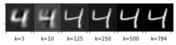

# Eigen-Digits 
Singular Value Decomposition (SVD) is a factorization of a matrix. In this report, we will show how to classify hand-written digits leveraging the aforementioned decomposition. 
There are about 60000 images in the MNIST dataset of hand-written digits. Each image can be represented by a vector. We will form a matrix for each number k, by putting vectors associated with k, in place of the columns. After that, we will approximate this matrix using truncated SVD and retrieve the principal components of the vector space of k. In order to classify an image, we will see which component can best estimate the given image. We will end the report by tuning the number of components to use.

You can read `report.pdf` to fully understand what SVD is and how we use it to classify hand-written digits. The PDF contains an embedded version of the code at `code.ipynb` that was used to generate images in the report. You can use the code to test the algorithm on other datasets. I highly recommend trying out eigen faces !! 

The report offers a comprehensive introduction to the underlying algorithms, but in order to pique your interest, I added the two following images here.

 

   
   
   
  Approximating images, representing numbers 3 and 4, with different number of components
    

### Build Yourself
You will need the following requirements
- Tex Live 
- [Xetex](https://www.ctan.org/pkg/xetex), a packge for rendering Farsi letters in Tex

### Acknowledgements 
This work was done as part of an undergraduate course in Numerical Linear Algebra by Amirkabir University of Technology. I wanted to thank Dr. Akbar Shirilord for his invaluable advice, continuous support, and detailed feedbacks. 
